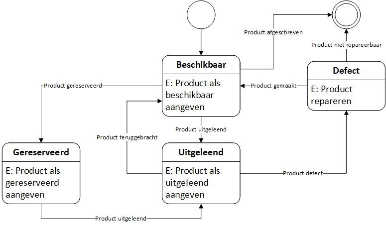
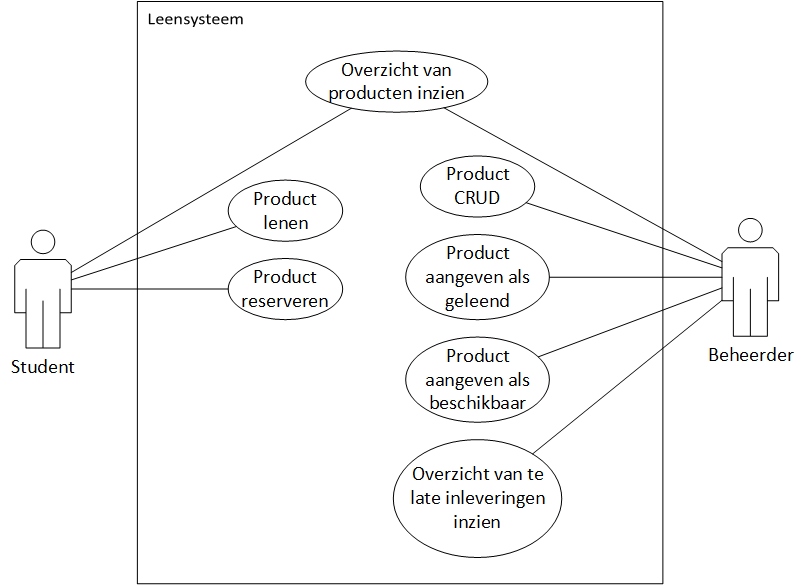

# Hardware uitleen app

Functioneel ontwerp

# Inhoudsopgave

1. [ Inleiding ](#inleiding)
2. [ Toestandsdiagram ](#statediag)
3. [ Use Case Diagram ](#ucdiag)
4. [ Use case Samenvattingen ](#ucsum)
5. [ Technische Eisen ](#tech-eisen)

# 01. Inleiding

Dit document beschrijft het Functioneel Ontwerp (FO) voor de Hardware Uitleen Applicatie (app) ontwikkeld voor de Hogeschool Utreccht (HU) voor het vak Front-End Development (VKFEP). Het is in drie maanden tijd ontwikkeld door de groep bestaande uit Luc van der Zandt, Marc Bosman en Robin de Bondt.
De opdracht was beschreven als het ontwikkelen van een simpel hardware uitleen systeem, waarbij studenten een stuk hardware van de school kunnen lenen, reserveren en inleveren, en de beheerders de hardware kunnen controleren op fouten zodat deze weer beschikbaar is voor de studenten om te lenen. De applicatie moet conform de opdracht een Javascript project zijn op basis van het Angular framework, waarbij de backend moet werken op door middel van Firebase.

# 02. Toestandsdiagram

Het onderstaande diagram beschrijft de diverse toestanden (states) waardoor een uitleenbaar hardware-item (product) verloopt als deze wordt geleend, gereserveerd, ingeleverd of gecontroleerd.

# 03. Use Case Diagram

Alle use cases die in het [ toestandsdiagram ](#statediag) aan het licht zijn gekomen zijn in het onderstaande use case diagram overzichtelijk neergezet. Voor deze applicatie worden twee actoren beschreven:

- Student (de persoon die leent, reserveert en inlevert)
- Beheerder (de persoon die de producten toevoegt, wijzigt, verwijdert, controleert, en te laat ingeleverde producten inziet)

# 04. Use Case Samenvattingen

In de onderstaande tabel wordt de werking van elke reeds beschreven [ use case ](#ucdiag) uitgebreid verklaard. Hierbij worden variabelen die door de gebruiker worden ingevoerd gemarkeerd met __ingaand__(in) en door de gebruiker ingevoerde variabelen die het systeem uitvoert als __uitgaand__(out)

Actor               | Use Case                              | Samenvatting
------------------- | ------------------------------------- | ----
Student             | Product lenen                         | De student kan alleen producten lenen met de status "Beschikbaar", of, als het product de status "Gereserveerd" heeft en het emailadres van de student bij het gereserveerde product staat. Als een student een product heeft gekozen om te lenen, krijgt dit product de status "Uitgeleend".  Het systeem genereerd een uiterste inleverdatum voor het product op basis van het huidige schoolblok. De uiterste inleverdatum zal dan gelijk staan aan het einde van de laatste dag van het huidige schoolblok. Het systeem voert ook automatisch het email adres van de ingelogde student in.
Student             | Product reserveren                    | Als een product al reeds de status "Uitgeleend" heeft, of als de student het product in het aankomende blok wil gebruiken, kan de student er voor kiezen om het product te reserveren. Het systeem wijst dan een reserveringsdatum toe aan het product.  Als het product nog de status "Beschikbaar" heeft, zal de reserveringsdatum gelijk staan aan de huidige dag. Als het product de status "Uitgeleend" heeft, zal de reserveringsdatum gelijk staan aan het begin van de eerste dag van het aankomende schoolblok. In beide gevallen zal het systeem het email van de student koppelen aan het product.
Student, Beheerder  | Overzicht van producten inzien        | De genoemde actoren moeten een overzicht van toegevoegde producten (out) kunnen inzien met per product de __titel__, de __details__, een __fotoimpressie__, de __status__ van het product (beschikbaar, uitgeleend, gereserveerd, defect) en in geval van een defect de __defectreden__ (out). De student heeft hier de mogelijkheid om een product te lenen. De beheerder heeft hier de mogelijkheid om producten toe te voegen, te verwijderen en aan te passen.
Beheerder           | Product toevoegen                     | De beheerder kan een product toevoegen door in het overzicht van producten op de knop "product toevoegen" te klikken en in het hieropvolgende scherm een __titel__, de __details__ en een __foto__ toe te voegen (in). 
Beheerder           | Product verwijderen                   | De beheerder kan een product verwijderen door in het overzicht van producten het __product__ te selecteren en op "product verwijderen" te klikken (in).
Beheerder           | Product aanpassen                     | De beheerder kan een product aanpassen door in het overzicht van producten of in het detailscherm van een product op de knop "product aanpassen" te klikken en in het hieropvolgende scherm de __titel__, __details__ en/of __foto__ aan te passen (in). 
Beheerder           | Product aangeven als geleend          | De beheerder kan een product aangeven als geleend door het __product__ te selecteren, hier een __student__ aan toe te wijzen, de __duur van de lening__ in te stellen en het __kluisnummer__ aan te geven (in). Het systeem stuurt hierop een bericht naar de student om die te voorzien van het __kluisnummer__ en de __kluiscode__ (out).
Beheerder           | Product aangeven als beschikbaar      | De beheerder kan een product aangeven als weer beschikbaar door het __product__ te selecteren en de status te wijzigen naar "beschikbaar" (in).
Beheerder           | Lijst van te late inleveringen inzien | Een product dat te laat is ingeleverd is gedefinieerd als een product met status "Uitgeleend", waarbij de uiterste inleverdatum kleiner (eerder) is als de huidige datum. De beheerder kan van het systeem een lijst opvragen met alle te laat ingeleverde producten. Hierbij geeft het systeem per product de uiterste inleverdatum en het emailadres van de student die het product heeft geleend.
Beheerder           | Product aangeven als defect           | Als een beheerder een defect constanteert met een product, dan behoort deze het product te markeren als defect. Het systeem geeft het product dan de status "Defect" en meldt hierbij de __defectreden__(in). het product kan dan niet meer worden uitgeleend. Een beheerder kan, na het oplossen van het defect of vervangen van het product het product ook weer aangeven als beschikbaar. Het systeem geeft het product dan wederom de status "Beschikbaar".

# 05. Technische Eisen

De applicatie wordt gerealiseerd als Angular[1](#angular) applicatie die gebruikt maakt van een Firebase[2](#firebase) database voor opslag van data.

De code wordt beheerd en opgeslagen in deze GitHub repository. Code wordt geschreven in feature branches, welke samengevoegd worden in de development branch en daar worden getest alvorens in de master branch te belanden.

# 06. Bronnen

[1] Google, Inc. (2019). *Angular*. Opgehaald op 20 mei 2019 van angular.io: https://angular.io/.

[2] Google, Inc. (2019). *Firebase*. Opgehaald op 20 mei 2019 van firebase.google.com: https://firebase.google.com/.
