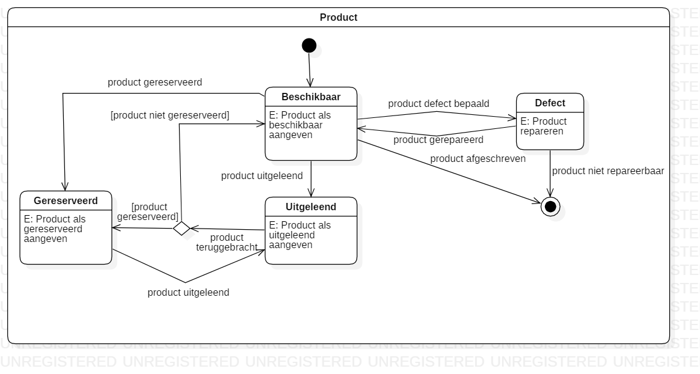
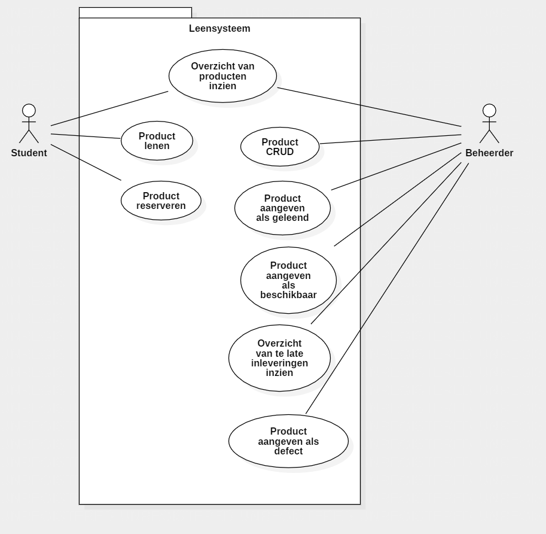

# Hardware uitleen app

Functioneel ontwerp

# Inhoudsopgave

1. [ Inleiding ](#inleiding)
2. [ State diagrams ](#statediag)
3. [ Use case diagram ](#ucdiag)
4. [ Use case summaries ](#ucsum)

# 01. Inleiding

TODO

# 02. State diagrams

sometext

# 03. Use Case diagram

sometext

# 04. Use case summary

sometext