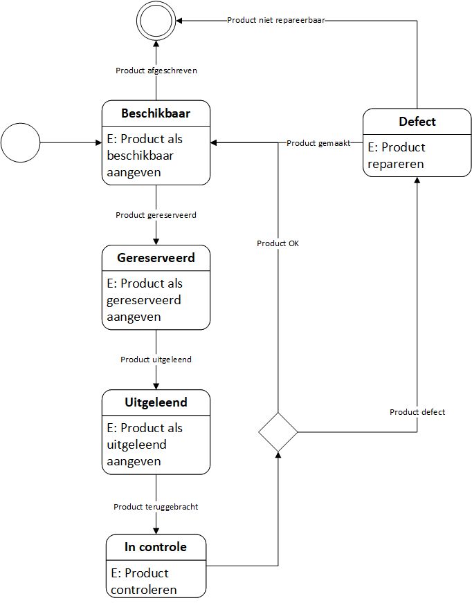

# Hardware uitleen app

## Functioneel ontwerp

### Door Luc van der Zandt, Marc Bostman en Robin de Bondt

# Inhoudsopgave

1. [ Inleiding ](#inleiding)
2. [ Actoren ](#actoren)
2. [ State diagrams ](#statediag)
3. [ Use case diagram ](#ucdiag)
4. [ Use case summaries ](#ucsum)

# 01. Inleiding

Dit document beschrijft het Functioneel Ontwerp (FO) voor de Hardware Uitleen Applicatie (app) ontwikkeld voor de Hogeschool Utreccht (HU) voor het vak Front-End Development (VKFEP). Het is in drie maanden tijd ontwikkeld door de groep bestaande uit Luc van der Zandt, (Marc Bosman?) en Robin de Bondt.
De opdracht was beschreven als het ontwikkelen van een simpel hardware uitleen systeem, waarbij studenten een stuk hardware van de school kunnen lenen, reserveren en inleveren, en de beheerders de hardware kunnen controleren op fouten zodat deze weer beschikbaar is voor de studenten om te lenen. De applicatie moet conform de opdracht een Javascript project zijn op basis van het Angular framework, waarbij de backend moet werken op door middel van Firebase.

# 02. Actoren

Voor deze applicatie worden twee actoren beschreven:

- Student (de persoon die leent, reserveert en inlevert)
- Beheerder (de persoon die de producten toevoegt, wijzigt, verwijdert, controleert, en te laat ingeleverde producten inziet)

# 03. State diagrams

Het object "product" kan zich in een aantal "staten" (states) bevinden. Het door de actors uitvoeren van use cases beïnvloedt vervolgens de status van het product.
Het onderstaande diagram beschrijft de diverse staten waardoor een uitleenbaar hardware-item (product) verloopt als deze wordt geleend, gereserveerd, ingeleverd of gecontroleerd.

Uit dit diagram zijn de volgende use cases afgeleid.

### Actor: Student/Beheerder
- Overzicht van producten inzien
### Actor: Student
- Product reserveren
- Product inleveren
### Actor: Beheerder
- Product CRUD (product toevoegen, wijzigen, afschrijven)
- Product aangeven als gereserveerd
- Product aangeven als uitgeleend
- Product aangeven als beschikbaar
- Product controleren op defecten
- Overzicht van te late inleveringen inzien

# 04. Use Case diagram

Alle use cases die in het [ state diagram ](#statediag) aan het licht zijn gekomen zijn in het onderstaande use case diagram overzichtelijk neergezet.

# 05. Use case summaries

In de onderstaande tabel wordt de werking van elke reeds beschreven [ use case ](#ucdiag) uitgebreid verklaard. Hierbij worden variabelen die door de gebruiker worden ingevoerd gemarkeerd met __ingaand__(in) en door de gebruiker ingevoerde variabelen die het systeem uitvoert als __uitgaand__(out).

Actor               | Use Case                              | Samenvatting
------------------- | ------------------------------------- | ----
Student, Beheerder  | Overzicht van producten inzien        | De genoemde actoren moeten een overzicht van toegevoegde producten kunnen inzien met per product de __titel__ (out), de __details__ (out), een __fotoimpressie__ (out), de __inleverdatum__ (out) en de __status__ (out) van het product (beschikbaar, uitgeleend, gereserveerd, defect). De beheerder krijgt in het overzicht ook de __studentmail__ (out) van het product te zien. Bij producten met de status "beschikbaar" heeft de student de optie om het product te reserveren. Bij een product met de status "gereserveerd" heeft de beheerder de optie om het product aan te geven als uitgeleend. Bij een product met de status "uitgeleend" en waarbij de __studentmail__ (out) overeenkomt met de huidige ingelogde student, krijgt de student te zien dat hij deze momenteel aan het lenen is, en kan deze de __kluisnummer__ (out) inzien. Bij een product met de status "in controle" kan de beheerder het __kluisnummer__ (out) van het product inzien en heeft de beheerder de optie om het product te controleren op defecten. Bij een product met de status "defect" kan de beheerder de __defectreden__ (out) van het product inzien en heeft de beheerder de optie om het product aan te geven als beschikbaar.
Student             | Product reserveren                    | De student kan bij producten met de __status__ (out) "beschikbaar" er voor kiezen om het product te reserveren. De student selecteert in het overzicht van producten dan de optie om het product te reserveren. De student bevestigt zijn __studentmail__ (in), dat door het systeem automatisch wordt ingevuld, en __inleverdatum__ (in), dat door het systeem automatisch wordt ingevuld als het einde van het huidige schoolblok[1](#ucsum_sup1). Dit betekent dat hetzelfde product niet meer in hetzelfde schoolblok kan worden geleend door een andere actor, tenzij de actor besluit om het product vervroegd in te leveren. Het product krijgt dan de __status__ (in) "gereserveerd". De student heeft pas daadwerkelijk toegang tot het product nadat de beheerder de use case "product aangeven als uitgeleend" heeft afgerond.
Student             | Product inleveren                     | Als de actor in het overzicht ziet dat de __inleverdatum__ (out) van een product met de __status__ (out) "uitgeleend" nadert, of als de actor al vervroegd klaar is met het gebruik van het product en wenst deze weer in te leveren, legt de actor het product weer terug in de kluis. De actor selecteert in het systeem vervolgens de optie "inleveren", en noteert hierbij het __kluisnummer__ (in). Het systeem markeert de __status__ (in) van het product vervolgens als "in controle", en de __inleverdatum__ (in) van het product wordt leeggemaakt.
Beheerder           | Product toevoegen                     | De beheerder kan een product toevoegen door in het overzicht van producten de optie om producten toevoegen te selecteren, en in het hieropvolgende scherm een __titel__ (in), de __details__ (in) en een __fotoimpressie__ (in) van het product in te voeren. Een nieuw product krijgt ook de __status__ (in) "beschikbaar" toegewezen.
Beheerder           | Product afschrijven                   | Als een product met de __status__ (out) "defect" onherstelbaar is, of als het einde van zijn leeftijd nadert, of als het product niet vaak genoeg wordt geleend of wordt vervangen door een nieuwer product, kan de actor er voor kiezen om het product af te schrijven. De actor selecteert in het overzictht van producten de optie afschrijven. Het product wordt dan verwijderd uit het systeem en is niet meer zichtbaar voor alle soorten actoren. De actor kan alleen producten afschrijven met de __status__ (out) "beschikbaar" of "defect".
Beheerder           | Product wijzigen                      | De beheerder kan een product aanpassen door in het overzicht van producten of in het detailscherm van een product op de knop "product aanpassen" te klikken en in het hieropvolgende scherm de __titel__ (in), __details__ (in) en/of __foto__ (in) aan te passen. 
Beheerder           | Product aangeven als gereserveerd     | Als een student persoonlijk de actor benadert om een product te reserveren, kan de actor het product in het systeem voor de student reserveren. De actor kan alleen prodcuten reserveren met de __status__ (out) "beschikbaar". De actor selecteert in het overzicht van producten de optie om een product te reserveren. Hierbij vult de actor de __studentmail__ (in) en de __inleverdatum__ (in) in. Het product krijgt vervolgens de __status__ (in) "gereserveerd". De actor moet vervolgens de use case "product aangeven als uitgeleend" afronden voordat de student het product daadwerkelijk kan meenemen.
Beheerder           | Product aangeven als uitgeleend       | Als een student een product heeft gereserveerd, is het de verantwoordelijkheid van de actor om deze in de klus te leggen. De beheerder kan een product met de __status__ (out) "gereserveerd" aangeven als uitgeleend door in het overzicht van producten de optie te seleccteren om een product uit te lenen. Hierbij moet de actor ook het __klusnummer__ (in) noteren van de klus waar de actor het product in heeft gelegd. Het product krijgt vervolgens de __status__ (in) "uitgeleend". Vanaf dat moment heeft de student toegang tot het product en kan deze het __kluisnummer__ (out) inzien in het overzicht van producten.
Beheerder           | Product aangeven als beschikbaar      | Als de actor een product met de __status__ (out) "defect" heeft gerepareerd, kan deze er voor kiezen om het product weer als beschikbaar te stellen. De actor selecteert dan in het overzicht van producten de optie om het product als beschikbaar te stellen. Het product krijgt dan de __status__ (in) "beschikbaar", en de __defectreden__ (in) en __studentmail__ (in) van het product wordt leeggemaakt.
Beheerder           | Product controleren op defecten       | Als een student een product heeft ingeleverd, heeft de actor de verantwoordelijkheid om het product te controleren op defecten. De actor kan een product met de __status__ (out) "in controle" controleren door in het overzicht van producten de optie om te controleren te selecteren. De actor kan dan met het __kluisnummer__ (out) het product uit de kluis halen en controleren. Als de actor constateert dat het product onbeschadigd en functioneel is, selecteert de actor de optie om het product als beschikbaar te stellen. Het product krijgt dan de __status__ (in) "beschikbaar", en de __studentmail__ (in) van het product wordt leeggemaakt. Als de actor *wel* defecten of beschadigingen constateert met het product, dient deze de optie om een product aan te geven als defect te selecteren. De actor vult dan de __defectreden__ (in) van het product. Het product krijgt dan de __status__ (in) "defect".
Beheerder           | Lijst van te late inleveringen inzien | De actor kan een overzicht opvragen van alle producten die studenten te laat hebben ingeleverd. Een product dat te laat is ingeleverd is gedefinieerd als een product met __status__ (out) "uitgeleend", waarbij de __inleverdatum__ (out) kleiner (eerder) is als de huidige datum. De actor krijgt beide velden in het overzicht te zien, alsmede de __studentmail__ (out) om de student te contacteren, de __titel__ (in), de __details__ (in) en een __fotoimpressie__ (in).

Voetnoten:
1.  Schoolblok: Een periode van ongeveer drie maanden. De lessen binnen de school worden dusdanig ingedeeld dat de tentamens of assesments van een les voor het einde van het schoolblok zijn afgerond. Er kan dus van uit worden gegaan dat een student na het einde van het schoolblok klaar is met het gebruik van het geleende product. Als de student het product nog nodig heeft voor een volgend schoolblok, bijvoorbeeld vanwege een herkansing, dient de student het product opnieuw te reserveren en te lenen.